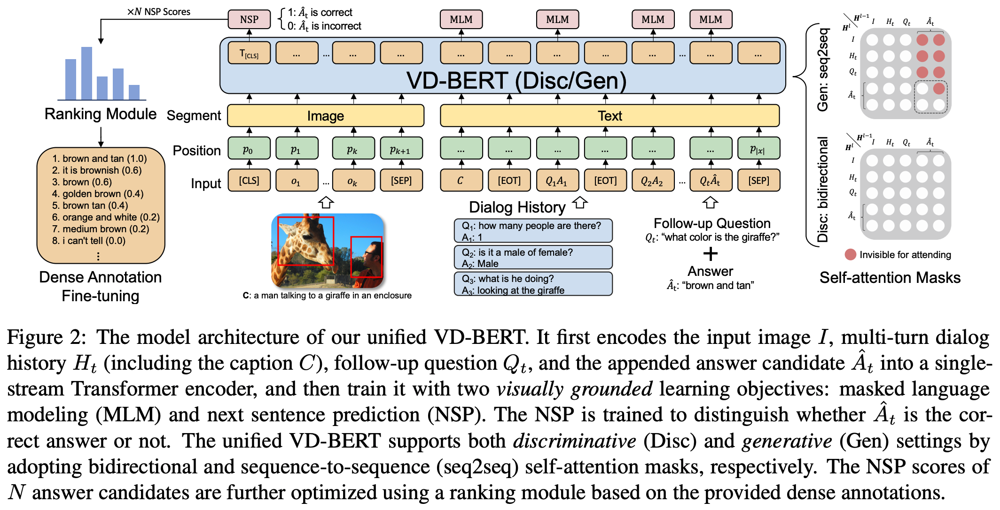

# VD-BERT: A Unified Vision and Dialog Transformer with BERT
PyTorch Code for the following paper at EMNLP2020:\
**Title**: VD-BERT: A Unified Vision and Dialog Transformer with BERT [pdf] \
**Authors**: Yue Wang, Shafiq Joty, Michael R. Lyu, Irwin King, Caiming Xiong, Steven C.H. Hoi\
**Institute**: Salesforce Research and CUHK \
**Abstract** \
Visual dialog is a challenging vision-language task, where a dialog agent needs to answer a series of questions through reasoning on the image content and dialog history. Prior work has mostly focused on various attention mechanisms to model such intricate interactions. By contrast, in this work, we propose VD-BERT, a simple yet effective framework of unified vision-dialog Transformer that leverages the pretrained BERT language models for Visual Dialog tasks. The model is unified in that (1) it captures all the interactions between the image and the multi-turn dialog using a single-stream Transformer encoder, and (2) it supports both answer ranking and answer generation seamlessly through the same architecture. More crucially, we adapt BERT for the effective fusion of vision and dialog contents via visually grounded training. 
Without the need of pretraining on external vision-language data, our model yields new state of the art, achieving the **top position** in both single-model and ensemble settings (*74.54 and 75.35 NDCG scores*) on the 
visual dialog [leaderboard](https://evalai.cloudcv.org/web/challenges/challenge-page/161/leaderboard/483#leaderboardrank-1).

**Framework illustration**\



## Installation
**Package**: Pytorch 1.1; We alo provide our Dockerfile and YAML file for setting up experiments in Google Cloud Platform (GCP). \
**Data**: you can obtain the VisDial data from [here](https://visualdialog.org/data) \
**Visual features**: we provide bottom-up attention visual features of VisDial v1.0 on ``data/img_feats1.0/``. 
If you would like to extract visual features for other images, please refer to [this docker image](https://hub.docker.com/r/airsplay/bottom-up-attention).
We provide the running script on ``data/visual_extract_code.py``, which should be used inside the provided bottom-up-attention image.

## Code explanation
``vdbert``: store the main training and testing python files, data loader code, metrics and the ensemble code;

``pytorch_pretrained_bert``: mainly borrow from the Huggingface's [pytorch-transformers v0.4.0](https://github.com/huggingface/pytorch-transformers/tree/v0.4.0);
* `modeling.py`: we modify or add two classes: `BertForPreTrainingLossMask` and `BertForVisDialGen`;
* `rank_loss.py`: three ranking methods: ListNet, ListMLE, approxNDCG;

``sh``: shell scripts to run the experiments

``pred``: store two json files for best single-model (74.54 NDCG) and ensemble model (75.35 NDCG)

<!--- ``data``: VisDial json data and image visual features (size: 38G) --->

``model``: You can download a pretrained model from https://storage.cloud.google.com/sfr-vd-bert-research/v1.0_from_BERT_e30.bin

## Running experiments
Below the running example scripts for pretraining, finetuning (including dense annotation), and testing.
* Pretraining
  ``bash sh/pretrain_v1.0_mlm_nsp_g4.sh``
* Finetuning for discriminative
  ``bash sh/finetune_v1.0_disc_g4.sh``
* Finetuning for discriminative specifically on dense annotation
  ``bash sh/finetune_v1.0_disc_dense_g4.sh``
* Finetuning for generative
  ``bash sh/finetune_v1.0_gen_g4.sh``
* Testing for discriminative on validation
  ``bash sh/test_v1.0_disc_val.sh``
* Testing for generative on validation
  ``bash sh/test_v1.0_gen_val.sh``
* Testing for discriminative on test
  ``bash sh/test_v1.0_disc_test.sh``
  
**Notation**: *mlm: masked language modeling, nsp: next sentence prediction, disc: discriminative, gen: generative, g4: 4 gpus, dense: dense annotation*


# Citation
If you find the code useful in your research, please consider citing our paper:
```
@inproceedings{
    wang2020vdbert,
    title={VD-BERT: A Unified Vision and Dialog Transformer with BERT},
    author={Yue Wang, Shafiq Joty, Michael R. Lyu, Irwin King, Caiming Xiong, Steven C.H. Hoi},
    booktitle={Proceedings of the 2020 Conference on Empirical Methods in Natural Language Processing, EMNLP 2020},
    year={2020},
}
```
  
# License
This project is licensed under the terms of the MIT license. 
